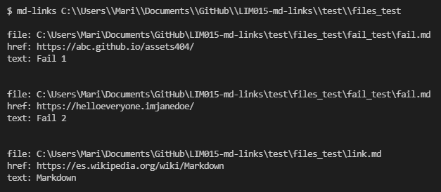
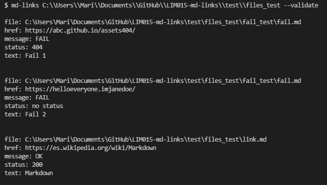
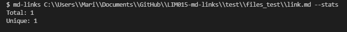
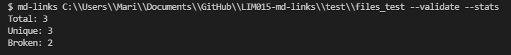
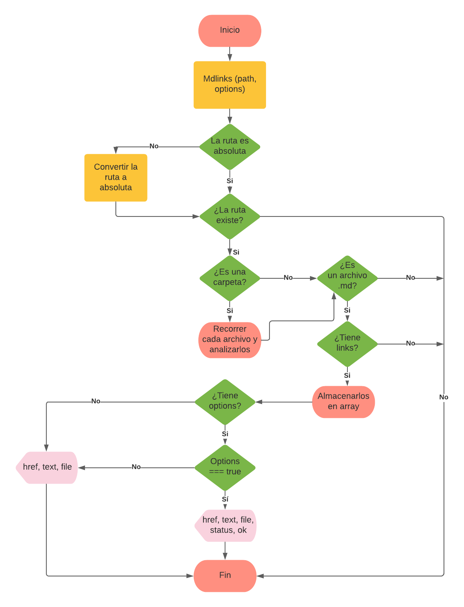
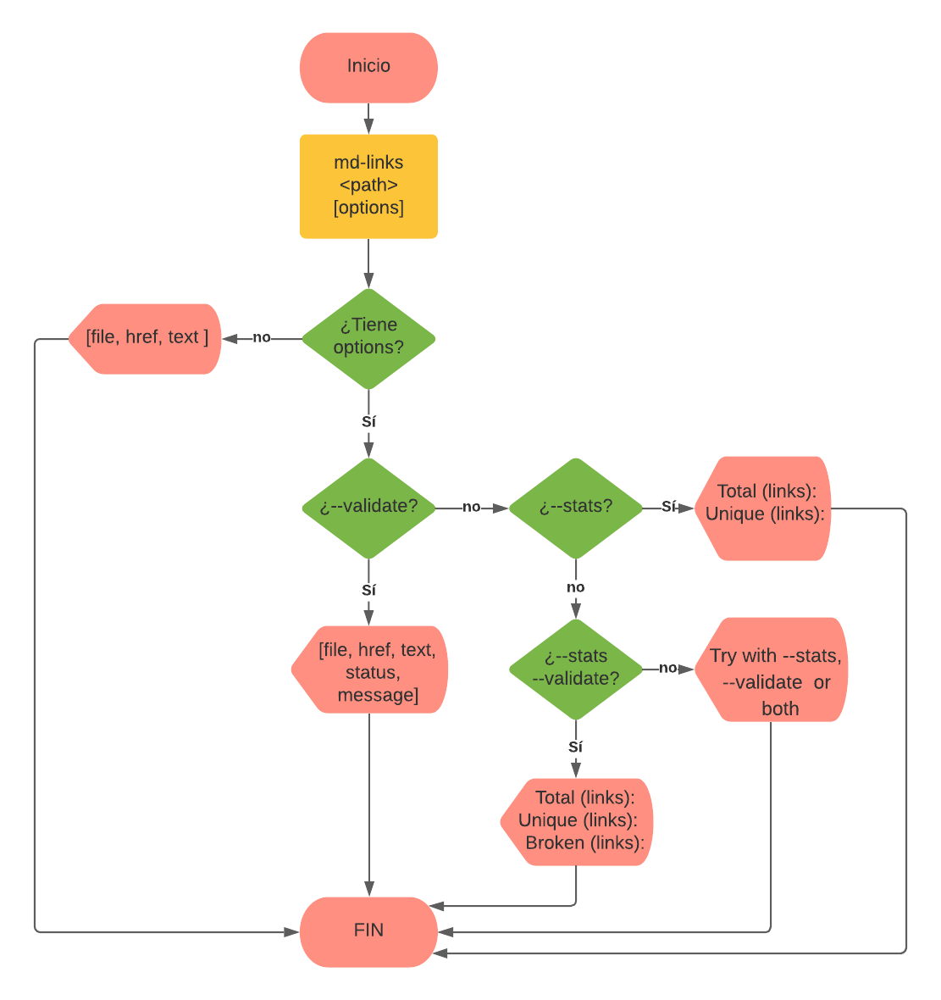

# Markdown Links

Md-links es una librería que permite la validación de estatus de URLs que se encuentran dentro de archivos Markdown (.md), a la vez permite obtener estadísticas sobre: total de links, links únicos y links rotos.

## 1. Instalación

Mediante npm:

`$ npm i lim015-mdlinks`

Mediante repo de github:

`$ npm i --global MariaCamposs/LIM015-md-links`

## 2. Guía de uso

Para acceder a `mdLinks` debemos importar con
`const mdLinks = require('lim014-mdlinks')` 

### 1) JavaScript API

Esta es una promesa `mdLinks(path, options)` que recibe dos parámetros: `path` (ruta absoluta o relativa) y `options` que retorna un array de objetos por cada link que contiene sus propiedades (file, href y text).

#### Ejemplo (resultados como comentarios)

```js
const mdLinks = require("md-links");

mdLinks("./some/example.md")
  .then((links) => {
    // => [{ href, text, file }, ...]
  })
  .catch(console.error);

mdLinks("./some/example.md", { validate: true })
  .then((links) => {
    // => [{ href, text, file, status, ok }, ...]
  })
  .catch(console.error);

mdLinks("./some/dir")
  .then((links) => {
    // => [{ href, text, file }, ...]
  })
  .catch(console.error);
```

### 2) CLI (Command Line Interface - Interfaz de Línea de Comando)

Esta aplicación debe poderse puede ejecutar a través de la **terminal**:

`md-links <path-to-file> [options]`

Por ejemplo:



#### Options

##### `--validate`

Si pasamos la opción `--validate`, el módulo hace una petición HTTP para
averiguar si el link funciona o no. Si el link resulta en una redirección a una
URL que responde ok, entonces consideraremos el link como ok.

Por ejemplo:



Vemos que el _output_ en este caso incluye la palabra `ok` o `fail` después de
la URL, así como el status de la respuesta recibida a la petición HTTP a dicha
URL.

##### `--stats`

Si pasamos la opción `--stats` el output (salida) será un texto con estadísticas
básicas sobre los links.



También podemos combinar `--stats` y `--validate` para obtener estadísticas que
necesiten de los resultados de la validación.


## 3. Diagramas de flujo

### API



### CLI

